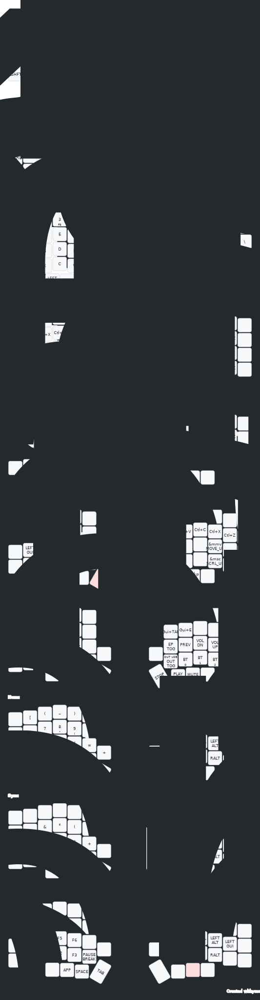

## A port of the Miryoku layout into Keymap Editor for the Lily58. 

I wanted to be able to make changes to the layout in the future without having to do it via [Miryoku Babel](https://github.com/manna-harbour/miryoku_babel) as I have zero coding experience. 

Please do keep in mind that this is meant specifically for the Lily58 Wireless from [Typeractive](https://typeractive.xyz/) which uses ZMK. I have no clue how this translates to any other Lily58.

Thanks. : )

Known Issues:
- keybr seems to misbehave egregiously with this layout; however, there is a workaround in place. If you use specifically the GAME layout, keybr will behave "correctly" provided you've set it to be on Language: English - Layout: Colemak-DH - ✅ Emulate Layout - Geometry: Matrix/Ergonomic.

Credits
- [Miryoku](https://github.com/manna-harbour/miryoku/)
- [Keymap Editor](https://nickcoutsos.github.io/keymap-editor/)
- [Keymap Drawer](https://keymap-drawer.streamlit.app/)
- [nice!view gem](https://github.com/M165437/nice-view-gem)
- [Typeractive Firmware](https://docs.typeractive.xyz/build-guides/lily58-wireless/firmware)

